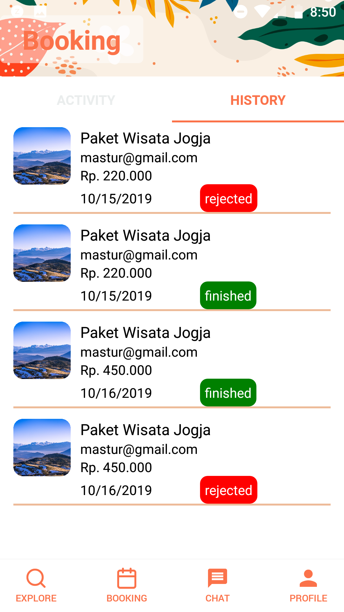

<h1 align='center'>Uklam</h1>   

  

   

## Table of Contents

- [Introduction](#introduction)
- [Features](#features)
- [Requirements](#requirements)
- [Usage](#usage-for-development)
- [Screenshots](#screenshots)
- [Release APK](#release-apk)
- [Contributors](#contributors)

## Introduction

Uklam is a Must Have App for Traveler who want to explore popular destination with professional guide on affordable price.
&nbsp;
There is also Uklam Apps build for Guide, where Guide can register, add travel package, and many other, please check this [`Repo by Fastaman`](https://github.com/fastaman993/UklamAppsGuide)

## Features

- Explore Indonesian Vacation Site with Local Guide
- Chat and notifications
- And others

## Requirements

- [`react-native`](https://facebook.github.io/react-native/docs/getting-started)
- [`react-native-cli`](https://facebook.github.io/react-native/docs/getting-started)
- [`Setting Up Provider Firebase`](https://console.firebase.google.com)
- [`Setting Up Uklam Backend`](https://github.com/Gimindika/uklam-express-backend)
- [`Setting Up Axios`](https://github.com/axios/axios)

## Usage for development

1. Open your terminal or command prompt
2. Type `git clone https://github.com/fikribasa/UklamApps`
3. Open the folder and type `npm install` for install dependencies
4. Before run this, you must run Uklam-backend
5. Rename config.js.example to config.js on folder /src/Configs using your own firebase application
6. Add Google Cloud Platform api key on `/android/app/src/main/AndroidManifest.xml`
7. Type `react-native run-android` for run this app.

## Screenshots

  

    
      
      &nbsp;&nbsp;
       
      &nbsp;&nbsp;
       
      &nbsp;&nbsp;
    
  

  
  
  

    
      
      &nbsp;&nbsp;
       
      &nbsp;&nbsp;
       
      &nbsp;&nbsp;
    
  

  
  

    
      
      &nbsp;&nbsp;
       
      &nbsp;&nbsp;
       
      &nbsp;&nbsp;
    
  

  

    
      
      &nbsp;&nbsp;
       
      &nbsp;&nbsp;
       
      &nbsp;&nbsp;
    
  

## Release APK

<a href="https://drive.google.com/file/d/1y9RGvpgDUG2NGo7tGkGW3HRaWi7oK08Y/view?usp=sharing">
  Download here
</a>

## Contributors

<table border="0">
  <tr>
    <td align="center">
      <a href="https://github.com/fastaman993">
         
          <b>Adhy F. Khoirot</b>
      </a>
    </td>
    <td align="center">
      <a href="https://github.com/mahendragalih26">
         
          <b>Galih Mahendra W</b>
      </a>
    </td>
    <td align="center">
      <a href="https://github.com/Gimindika">
         
          <b>Gerrit Indika Mulya</b>
      </a>
    </td>
    <td align="center">
      <a href="https://github.com/fikribasa">
         
          <b>M Fikri Basa</b>
      </a>
    </td>
  </tr>
</table>
